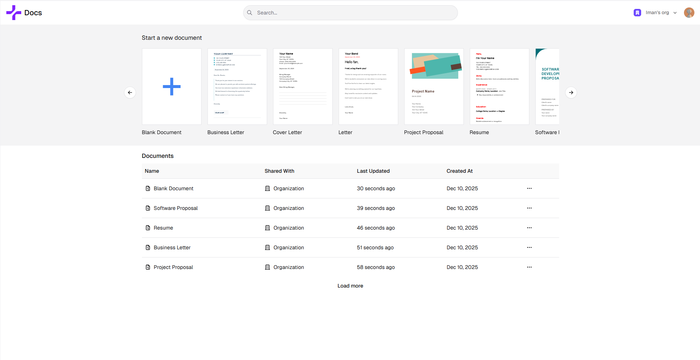
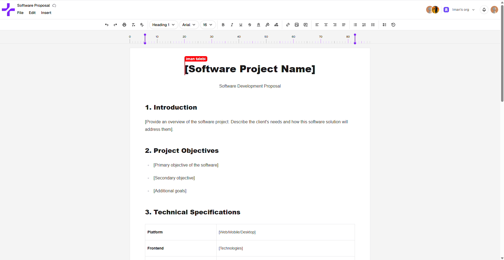

# Next Docs

A full stack collaborative Google Docs–style editor built with Next.js.

## Features

- Real-time collaborative editing with presence, cursors, and comments powered by Liveblocks + Tiptap.
- Auth, organizations, and user management via Clerk.
- Document Management Using Convex and Tanstack Query.
- Modern UI with Shadcn/UI components and Tailwind CSS v4.

## Screenshots

- Home view  
  
- Editor view  
  

## Quick start

1. Install dependencies (Node 20+):

   ```bash
   bun install
   # or pnpm install / npm install / yarn install
   ```

2. Create a `.env.local` with required values:

   ```text
    CONVEX_DEPLOYMENT=
    NEXT_PUBLIC_CONVEX_URL=
    NEXT_PUBLIC_APP_URL=
    NEXT_PUBLIC_CLERK_SIGN_IN_URL=/sign-in
    NEXT_PUBLIC_CLERK_SIGN_UP_URL=/sign-up
    NEXT_PUBLIC_CLERK_SIGN_IN_FALLBACK_REDIRECT_URL=/
    NEXT_PUBLIC_CLERK_SIGN_UP_FALLBACK_REDIRECT_URL=/
    NEXT_PUBLIC_CLERK_PUBLISHABLE_KEY=
    CLERK_SECRET_KEY=
    CLERK_JWT_ISSUER_DOMAIN=

    LIVEBLOCKS_SECRET_KEY=

    SKIP_ENV_VALIDATION=false
   ```

3. Run the dev server:

   ```bash
   bun dev
   ```

Visit `http://localhost:3000`.

## Scripts

- `bun run dev` — start the Next.js dev server.
- `bun run build` — production build.
- `bun start` — run the built app.
- `bun run lint` — lint with Ultracite/Biome (`bun run lint:fix` to auto-fix).

## Tech stack

Next.js (App Router) • TypeScript • Tailwind CSS • Shadcn/UI • Convex • Liveblocks • Clerk • Tiptap • TanStack Query • Zustand
